# ASETIN - Inventory Management System

ASETIN (Sistem Manajemen Inventaris Aset) adalah aplikasi berbasis web yang dikembangkan untuk mengelola data aset organisasi secara efisien. Sistem ini menyediakan fitur untuk mengelola kategori aset, merek, pemasok, lokasi, garansi, catatan pemeliharaan, dokumen pendukung, dan laporan. Aplikasi ini juga menerapkan kontrol akses berbasis peran untuk membedakan izin administrator dan staf.

---

## Project Information

| Item | Description |
|------|-------------|
| Framework | Laravel 13 |
| Language | PHP 8.3 |
| Database | MySQL |
| Container | Docker |
| Frontend | Bootstrap 5 |
| Template Engine | Blade |
| ORM | Eloquent |
| Authentication | Laravel Authentication |
| Role | Administrator & Staff |

---

## Features

- User Authentication (Login & Logout)
- Dashboard
- Category Management
- Brand Management
- Supplier Management
- Location Management
- Asset Management
- Warranty Management
- Maintenance Management
- Document Management
- Report Export (PDF & Excel)
- Role-Based Access Control

---

## User Roles

### Administrator

Administrator memiliki akses penuh ke semua modul.

- Dashboard
- Category
- Brand
- Supplier
- Location
- Asset
- Warranty
- Maintenance
- Document
- Report

### Staff

Staf bisa mengakses semua modul kecuali Manajemen Aset.

- Dashboard
- Category
- Brand
- Supplier
- Location
- Warranty
- Maintenance
- Document
- Report

---

## Database Structure

| Table |
|--------|
| users |
| categories |
| brands |
| suppliers |
| locations |
| assets |
| warranties |
| maintenances |
| documents |

---

## Entity Relationship Diagram (ERD)

<p align="center">
    
</p>

---

# System Screenshots

## Login

<p align="center">
    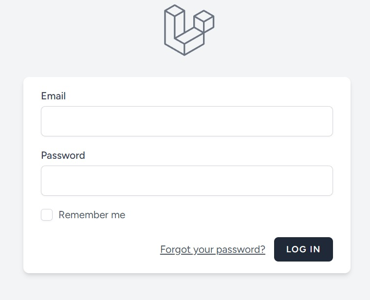
</p>

---

## Dashboard

<p align="center">
    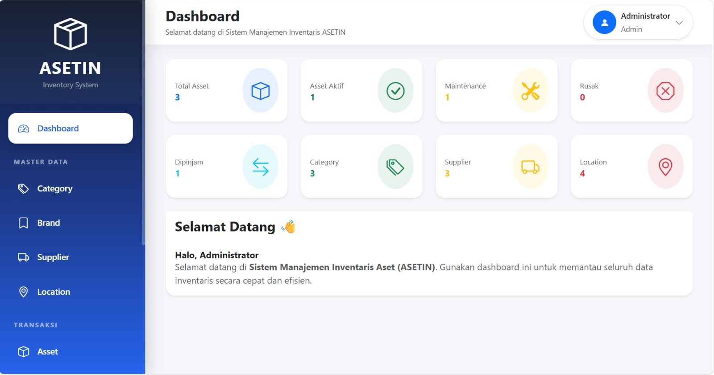
</p>

---

## Category

<p align="center">
    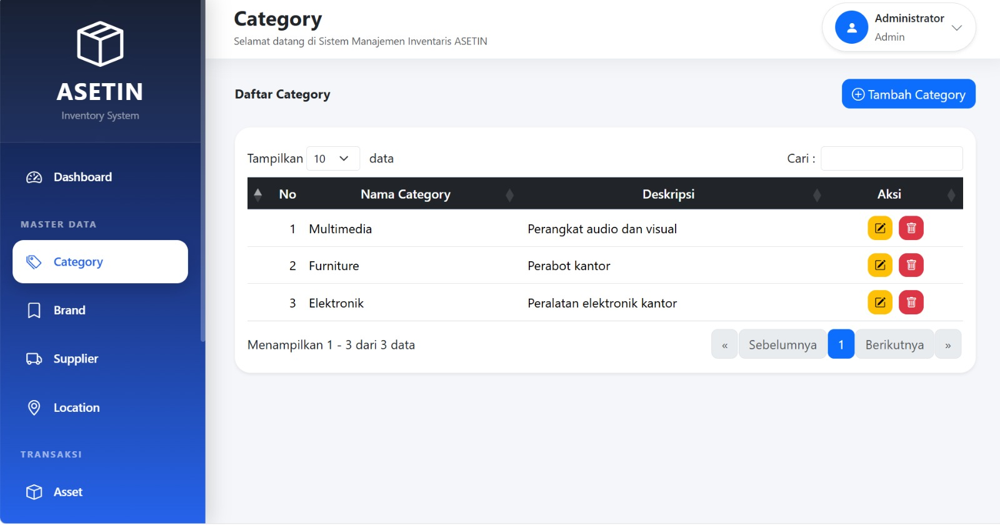
</p>

---

## Brand

<p align="center">
    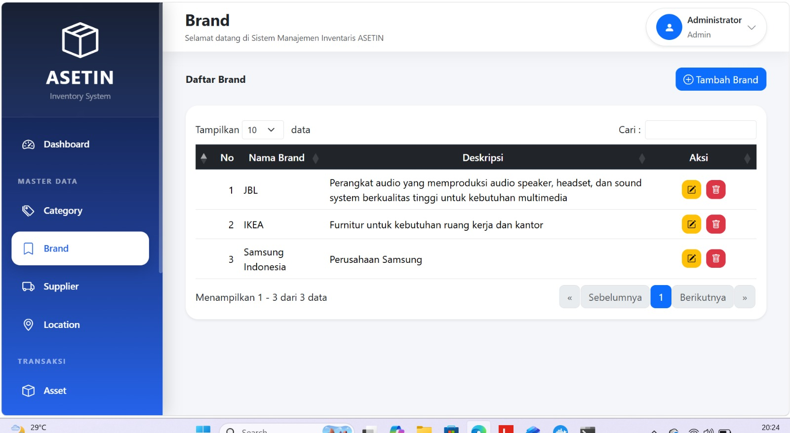
</p>

---

## Supplier

<p align="center">
    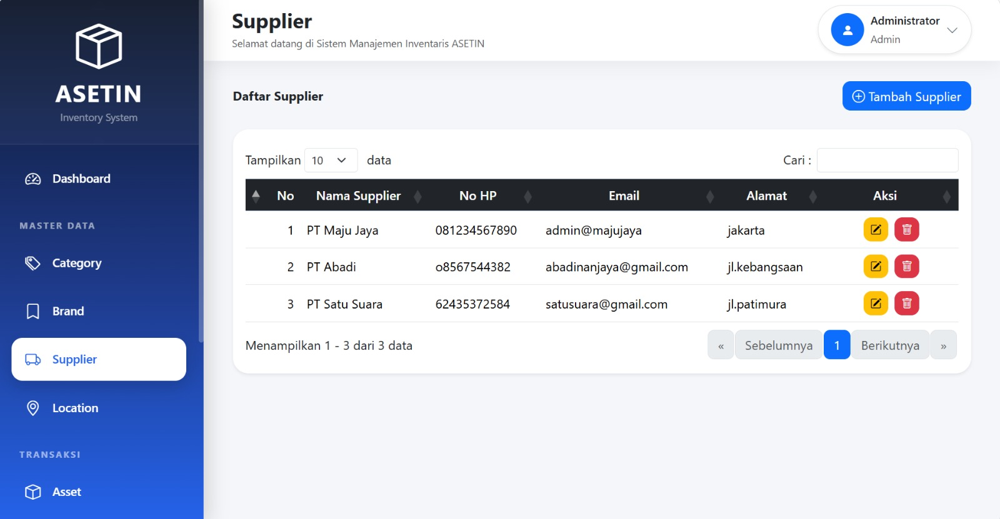
</p>

---

## Location

<p align="center">
    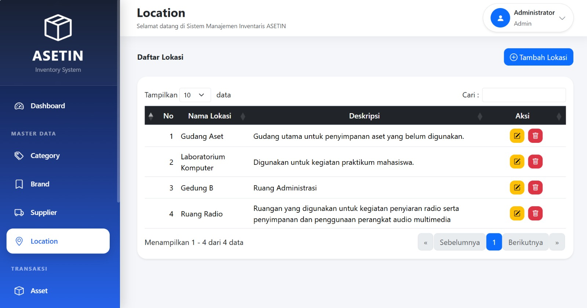
</p>

---

## Asset

<p align="center">
    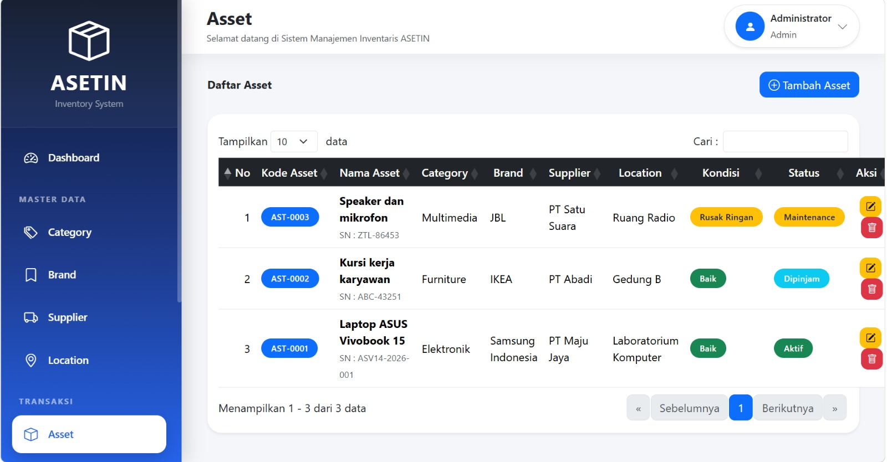
</p>

---

## Warranty

<p align="center">
    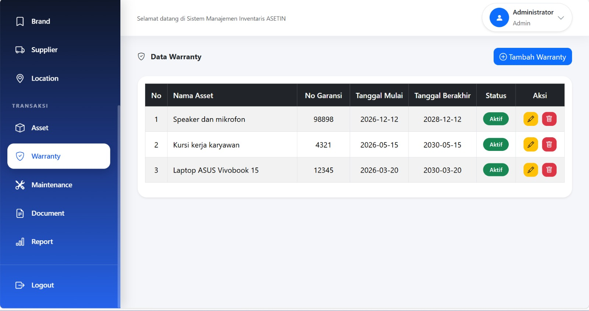
</p>

---

## Maintenance

<p align="center">
    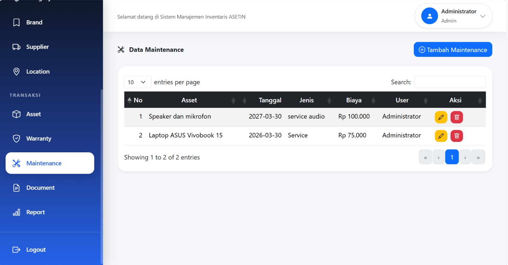
</p>

---

## Document

<p align="center">
    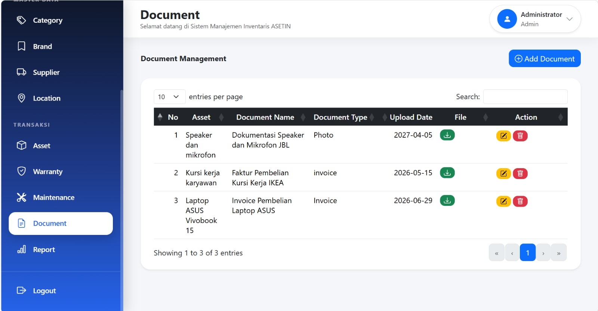
</p>

---

## Report

<p align="center">
    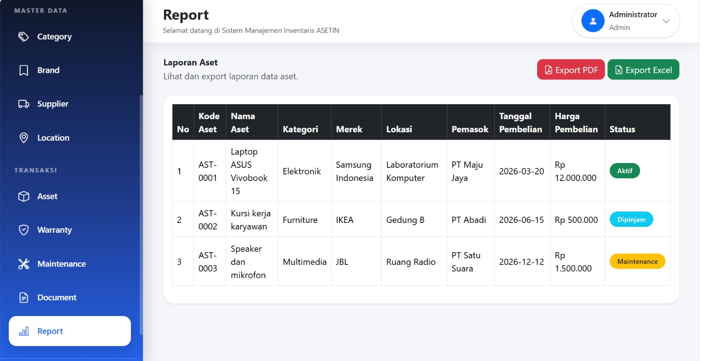
</p>

---

## Installation

Clone the repository

```bash
git clone https://github.com/nafisahani-web/AsetIn.git
```

Go to the project directory

```bash
cd AsetIn
```

Start Docker

```bash
docker compose up -d
```

Access the application container

```bash
docker compose exec app bash
```

Install dependencies

```bash
composer install
```

Copy environment configuration

```bash
cp .env.example .env
```

Generate application key

```bash
php artisan key:generate
```

Run database migrations

```bash
php artisan migrate
```

---

## Demo Account

### Administrator

| Email | Password |
|-------|----------|
| admin@asetin.com | admin123 |

### Staff

| Email | Password |
|-------|----------|
| staff@asetin.com | staff123 |

> Akun-akun ini disediakan hanya untuk tujuan demonstrasi.

---

## Main Modules

- Dashboard
- Category
- Brand
- Supplier
- Location
- Asset
- Warranty
- Maintenance
- Document
- Report

---

## Developer

**Name** : Nafisahani

**Study Program** : Information Systems

**University** : Universitas Nasional

---

## License

This project was developed as part of an academic assignment for the Information Systems Study Program at Universitas Nasional.
